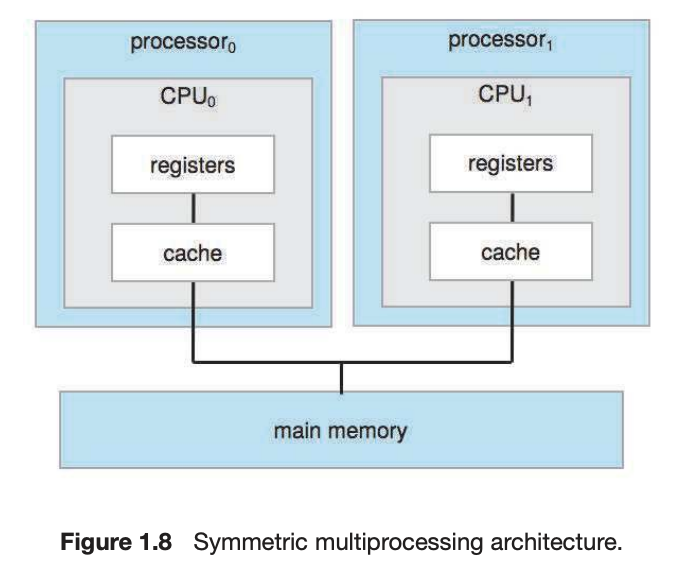

# Chapter 1. Introduction

## TOC

1. [1-1](#1-1)
2. [1-2](#1-2)
3. [1-3](#1-3)
4. [1-4](#1-4)
5. [1-5](#1-5)
6. [1-6](#1-6)
7. [1-7](#1-7)
8. [1-8](#1-8)
9. [1-9](#1-9)
10. [1-10](#1-10)
11. [1-11](#1-11)
12. [1-12](#1-12)
13. [1-13](#1-13)
14. [1-14](#1-14)
15. [1-15](#1-15)
16. [1-16](#1-16)
17. [1-17](#1-17)
18. [1-18](#1-18)
19. [1-19](#1-19)
20. [1-20](#1-20)
21. [1-21](#1-21)
22. [1-22](#1-22)
23. [1-23](#1-23)
24. [1-24](#1-24)
25. [1-25](#1-25)
26. [1-26](#1-26)
27. [1-27](#1-27)

## [1-1](#TOC)

### Q

What are the three main purposes of an operating system?

### A

1. resource allocater(cpu time, memory, storage, i/o, etc..)
2. control program
3. providing application program execution environment

## [1-2](#TOC)

### Q

We have stressed the need for an operating system to make efficient use of the computing hardware. When is it appropriate for the operating system to forsake this principle and to “waste” resources? Why is such a system not really wasteful?

### A

If very important, high-priority work is on, os need to focus all resources to that work.

#### solution ref)

Single-user systems should maximize use of the system for the user. A GUI might “waste” CPU cycles, but it optimizes the user's interaction with the system.

## [1-3](#TOC)

### Q

What is the main difficulty that a programmer must overcome in writing an operating system for a real-time environment?

### A

In Multitasking environment, a process shares hardware resources with other processes and if one process stopped to much because of other processes, the latency increases. To decrease latency, os must schedule processes properly.

#### solution ref)

The main difculty is keeping the operating system within the xed time constraints of a real-time system. If the system does not complete a task in a certain time frame, it may cause a breakdown of the entire system. Therefore, when writing an operating system for a real-time system, the writer must be sure that his scheduling schemes don't allow response time to exceed the time constraint.

## [1-4](#TOC)

### Q

Keeping in mind the various definitions of operating system, consider whether the operating system should include applications such as web browsers and mail programs. Argue both that it should and that it should not, and support your answers.

### A

1. **should include**

   - OS should make user to use computer system more easily. Some application makes computer system more easily.

2. **should not include**
   - OS should only control and allocate resource. Application is not OS's responsibility.

#### solution ref)

1. An argument in favor of including popular applications in the operating system is that

   - if the application is embedded within the operating system, it is likely to be better able to take advantage of features in the kernel and therefore have performance advantages over an application that runs outside of the kernel.

2. Arguments against embedding applications within the operating system typically dominate, however:

   - the applications are applications—not part of an operating system,
   - any performance benets of running within the kernel are offset by security vulnerabilities, and
   - inclusion of applications leads to a bloated operating system.

## [1-5](#TOC)

### Q

How does the distinction between kernel mode and user mode function as a rudimentary form of protection (security)?

### A

There are sensitive, important works like memory managing, i/o managing, etc. OS execute sensitive works in kernel mode, and if not in kernel mode, deny that works.

#### solution ref)

The distinction between kernel mode and user mode provides a rudimentary form of protection in the following manner. Certain instructions can be executed only when the CPU is in kernel mode. Similarly, hardware devices can be accessed only when the program is in kernel mode, and interrupts can be enabled or disabled only when the CPU is in kernel mode. Consequently, the CPU has very limited capability when executing in user mode, thereby enforcing protection of critical resource.

## [1-6](#TOC)

### Q

Which of the following instructions should be privileged?

a. Set value of timer.

b. Read the clock.

c. Clear memory.

d. Issue a trap instruction.

e. Turn off interrupts.

f. Modify entries in device-status table.

g. Switch from user to kernel mode.

h. Access I/O device.

### A

#### solution ref)

1. set value of timer
2. clear memory
3. turn off interrupts
4. Modify entries in device-status table
5. Access I/O device.

## [1-7](#TOC)

### Q

Some early computers protected the operating system by placing it in a memory partition that could not be modified by either the user job or the operating system itself. Describe two difficulties that you think could arise with such a scheme.

### A

1. If OS memory partition polluted, OS can't recovery itself.
2. If user want to change OS system config or way of working, it can't.

#### solution ref)

The data required by the operating system (passwords, access controls, accounting information, and so on) would have to be stored in or passed through unprotected memory and thus be accessible to unauthorized users.

## [1-8](#TOC)

### Q

Some CPUs provide for more than two modes of operation. What are two possible uses of these multiple modes?

### A

1. For virtual machine manager
2. For various OS service

#### solution ref)

Although most systems only distinguish between user and kernel modes, some CPUs have supported multiple modes. Multiple modes could be used to provide a ner-grained security policy. For example, rather than distinguishing between just user and kernel mode, you could distinguish between different types of user mode. Perhaps users belonging to the same group could execute each other's code. The machine would go into a specied mode when one of these users was running code. When the machine was in this mode, a member of the group could run code belonging to anyone else in the group.

Another possibility would be to provide different distinctions within kernel code. For example, a specic mode could allow USB device drivers to run. This would mean that USB devices could be serviced without having to switch to kernel mode, thereby essentially allowing USB device drivers to run in a quasi-user/kernel mode.

## [1-9](#TOC)

### Q

Timers could be used to compute the current time. Provide a short description of how this could be accomplished.

### A

#### solution ref)

A program could use the following approach to compute the current time using timer interrupts. The program could set a timer for some time in the future and go to sleep. When awakened by the interrupt, it could update its local state, which it uses to keep track of the number of interrupts it has received thus far. It could then repeat this process of continually setting timer interrupts and updating its local state when the interrupts are actually raised.

## [1-10](#TOC)

### Q

Give two reasons why caches are useful. What problems do they solve? What problems do they cause? If a cache can be made as large as the device for which it is caching (for instance, a cache as large as a disk), why not make it that large and eliminate the device?

### A

1. Problems cache solves
   - In modern computer system, data is in memory and caculation is in CPU. CPU must access to memory to get data, but memory access is slow. Cache is more faster than origin memory, more close to CPU.
2. Problems cache causes
   - data exsists in many places. lv1 cache, lv2 cache, main memory, 2st storage, etc. are where data are in. If data modified, all data in places must be modified also. Cache causes data inconsistency problem.
3. Why not make cache large
   - Cache is close to CPU and can access faster, but it costs more. If cache is bigger, also more expensive.

#### solution ref)

Caches are useful when two or more components need to exchange data, and the components perform transfers at differing speeds. Caches solve the transfer problem by providing a buffer of intermediate speed between the components. If the fast device finds the data it needs in the cache, it need not wait for the slower device. The data in the cache must be kept consistent with the data in the components. If a component has a data value change, and the datum is also in the cache, the cache must also be updated. This is especially a problem on multiprocessor systems, where more than one process may be accessing a datum. A component may be eliminated by an equal-sized cache, but only if: (a) the cache and the component have equivalent state-saving capacity (that is, if the component retains its data when electricity is removed, the cache must retain data as well), and (b) the cache is affordable, because faster storage tends to be more expensive.

## [1-11](#TOC)

### Q

Distinguish between the client–server and peer-to-peer models of distributed systems.

### A

1. client-server model
   - client send request, and server send back response.
   - server can be bottle-neck and can be failure point.
2. peer-to-peer model
   - all node can be both client and server.
   - there is no bottle-neck and high availability.

#### solution ref)

The client-server model firmly distinguishes the roles of the client and server. Under this model, the client requests services that are provided by the server. The peer-to-peer model doesn't have such strict roles. In fact, all nodes in the system are considered peers and thus may act as either clients or servers—or both. A node may request a service from another peer, or the node may in fact provide such a service to other peers in the system.

For example, let's consider a system of nodes that share cooking recipes. Under the client-server model, all recipes are stored with the server. If a client wishes to access a recipe, it must request the recipe from the specied server. Using the peer-to-peer model, a peer node could ask other peer nodes for the specied recipe. The node (or perhaps nodes) with the requested recipe could provide it to the requesting node. Notice how each peer may act as both a client (it may request recipes) and as a server (it may provide recipes).

## [1-12](#TOC)

### Q

How do clustered systems differ from multiprocessor systems? What is required for two machines belonging to a cluster to cooperate to provide a highly available service?

### A

Clustered systems are built with multiple computer system. Multiprocessor make computer system work several tasks in same time. Two machine works exactly same service to provide high availability. Then one machine takes down other machine can provide service.

#### solution ref)

## [1-13](#TOC)

### Q

Consider a computing cluster consisting of two nodes running a database. Describe two ways in which the cluster software can manage access to the data on the disk. Discuss the benefits and disadvantages of each.

### A

1. Message Passsing
   - benefits: easy implementation, no need to syncronization
   - disadvantage: message format overhead
2. Shared file/memory
   - benefits: faster than message passing
   - disadvantage: hard to implement, data consistency problem, need to syncronize

#### solution ref)

## [1-14](#TOC)

### Q

What is the purpose of interrupts? How does an interrupt differ from a trap? Can traps be generated intentionally by a user program? If so, for what purpose?

### A

1. purpose of interrupts

   - the way of communication with cpu and other hardwares. hardware sends interrupt to cpu to alert event or end of their works.

2. difference with interrupt and trap

   - interrupt includes hardware(and others also included, trap too), trap is for error and software generated interrupt because of user application's specific request.

3. Can traps be generated intentionally by a user program? what purpose?
   - Yes, if user program intentionally makes error, that generate traps.

#### solution ref)

## [1-15](#TOC)

### Q

Explain how the Linux kernel variables `HZ` and `jiffies` can be used to determine the number of seconds the system has been running since it was booted.

### A

Linux kernel variable `HZ` set timer interrupt occurrence frequency. 250 `HZ` means timer generate 250 interrupts per second. Variable `jiffies` show number of timer interrupts that occurred after system booting. Dividing `jiffies` to `HZ` variable can determine number of seconds the system has been running since it was booted.

#### solution ref)

## [1-16](#TOC)

### Q

Direct memory access is used for high-speed I/O devices in order to avoid increasing the CPU’s execution load.

a. How does the CPU interface with the device to coordinate the transfer?

b. How does the CPU know when the memory operations are complete?

c. The CPU is allowed to execute other programs while the DMA controller is transferring data. Does this process interfere with the execution of the user programs? If so, describe what forms of interference are caused.

### A

a. DMA controller set device buffer & pointer & I/O count and send whole data block btw memory and buffer without CPU.

b. DMA controller generate interrupt when data block sending finish.

c. Maybe interfere.. because DMA controller send interrupts when data block sending finished, and user program must be stopped to process interrupt.

#### solution ref)

## [1-17](#TOC)

### Q

Some computer systems do not provide a privileged mode of operation in hardware. Is it possible to construct a secure operating system for these computer systems? Give arguments both that it is and that it is not possible.

### A

1. **Possible**
   - Hardware support is not required to make OS secure. OS just check that operation is secure and do not execute insecure operation.
2. **Not possible**
   - Software support is hard to implement and make overhead. Hardware can easily check security and also fast.

#### solution ref)

## [1-18](#TOC)

### Q

Many SMP systems have different levels of caches; one level is local to each processing core, and another level is shared among all processing cores. Why are caching systems designed this way?

### A

If a multi-core system needs cache, it can be local level to each core or shared level with all cores. But both makes cache inefficient.

1. If cache is only on local level to each core, a core can access its data fast. But if a core should access to the data that processed in other core before, it can't access other core's cache and go to main memory. It makes things slow.
2. If cache is only one shared level with all cores, each core can access easily to other core's data. But the cores can't access to their own data more faster.

So, each-core cache makes cores to access faster with their own data and shared-core cache makes cores to access faster with other core's data.

#### solution ref)

## [1-19](#TOC)

### Q

Rank the following storage systems from slowest to fastest:

a. Hard-disk drives

b. Registers

c. Optical disk

d. Main memory

e. Nonvolatile memory

f. Magnetic tapes

g. Cache

### A

**slowest**:

1. Magnetic tapes
2. Optical disk
3. Hard-disk drives
4. Nonvolatile memory
5. Main memory
6. Cache
7. Registers

**Fastest**:

#### solution ref)

## [1-20](#TOC)

### Q

Consider an SMP system similar to the one shown in Figure 1.8. Illustrate with an example how data residing in memory could in fact have a different value in each of the local caches.

### A

Assume that cpu0 and cpu1 takes same data, which value is data0.

1. cpu0 get data0
2. cache0 get data0
3. cpu1 get data0
4. cache1 get data0
5. cpu0 change data0 to data1
6. cache0 change data0 to data1

In this situation, cache0 and cache1 has same data but its value is different(cache0 -> data1, cache1 -> data0).

#### solution ref)

## [1-21](#TOC)

### Q

Discuss, with examples, how the problem of maintaining coherence of cached data manifests itself in the following processing environments:

a. Single-processor systems

b. Multiprocessor systems

c. Distributed systems

### A

a. Single-processor systems

- If single processor changes the data in register, just write register value to cache. And when the value must be flushed from cache, write the cache value to main memory.

b. Multiprocessor systems

- Assume multi processor has same task and same data at their cache. Processor 1 and 2 each have their cache so processors cannot trust cache value at all. Processor 1 writes the data to main memory. And main memory retain the cached value list. If cached value changed, send signals to each cache of processor. Then cache remove the value that changed in main memory so next time cpu access to that value, cpu get data in main memory which is correct.

- In other way, Multiprocessor systems can make processor got their own task, not sharing with other processor. Then processors do not share its data, so maintaining cache coherence is simple like single-processor system.

c. Distributed systems

- In distributed systems, both cpu cache and main memory can take same data. Maybe origin data would be stored by one system in distributed systems. If one system changed the data, write to origin system's main memory. Then with some time interval, all systems check the origin system's data and if data is different, update their main memory and cache.

#### solution ref)

## [1-22](#TOC)

### Q

Describe a mechanism for enforcing memory protection in order to prevent a program from modifying the memory associated with other programs.

### A

Each program has its own process while executing. Each process take their own memory space and mapped to absolute address. Process can access memory only by absolute address and absolute address is mapped to process' own memory space, so process can't access out of their own memory space. OS allocate each process' memory space separately, so a program can't modify other program's memory.

#### solution ref)

## [1-23](#TOC)

### Q

Which network configuration — LAN or WAN — would best suit the following environments?

a. A campus student union

b. Several campus locations across a statewide university system

c. A neighborhood

### A

a. LAN

b. WAN

c. LAN

#### solution ref)

## [1-24](#TOC)

### Q

Describe some of the challenges of designing operating systems for mobile devices compared with designing operating systems for traditional PCs.

### A

1. Mobile devices have multiple sensors, so OS must support various sensor device drivers and interrupts.
2. Mobile devices are smaller than traditional PCs, so it has less processors and memory spaces. Mobile OS must be light and fast enough.
3. Mobile devices have long hours of use and limited battery capacity, so OS must optimize its power efficiency.

#### solution ref)

## [1-25](#TOC)

### Q

What are some advantages of peer-to-peer systems over client–server systems?

### A

1. p2p systems don't have division of client and server. In client-server systems, server can be bottle-neck so entire system's availability can be decreased by poor server. But p2p systems don't have bottle-neck.

#### solution ref)

## [1-26](#TOC)

### Q

Describe some distributed applications that would be appropriate for a peer-to-peer system.

### A

1. File sharing system. File is large to transfer by network, so server would be hard to receive all upload/download request in client-server systems. p2p systems can balancing the transferring with peer, and nodes can get fast response.

#### solution ref)

## [1-27](#TOC)

### Q

Identify several advantages and several disadvantages of open-source operating systems. Identify the types of people who would find each aspect to be an advantage or a disadvantage.

### A

1. advantages

   - find bugs easily
   - add features more frequently
   - systems can grow faster

2. disadvantages

   - systems can be easily analyzed
   - must check license compliance

#### solution ref)
